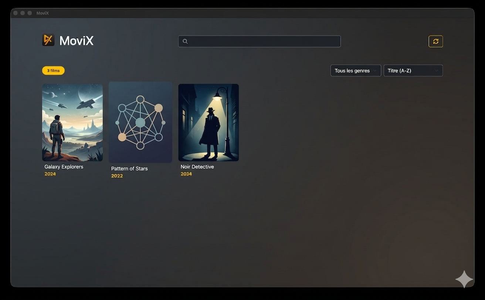

# 🎥 MoviX Desktop App

MoviX est une application de bureau fluide et immersive conçue pour transformer vos dossiers de films locaux en une véritable bibliothèque numérique interactive.

## ✨ Fonctionnalités Principales

### 🍿 Lecture & Suivi
- **Lecture Instantanée** : Lancez vos films directement depuis l'application dans votre lecteur vidéo habituel.
- **Indicateur de Visionnage** : Marquez vos films comme "Vus" d'un simple clic pour organiser votre progression.
- **Bandeau Visuel** : Un ruban "VU" discret et élégant s'affiche automatiquement sur les affiches des films concernés.

### 🎨 Expérience Cinématographique
- **Interface "Warm Cinema"** : Un design basé sur des dégradés profonds (Bleu Acier et Marron Terre) pour une ambiance premium.
- **Navigation Sans Rechargement** : Transitions fluides en fondu entre la collection et les fiches détaillées.
- **Fiches Détaillées Immersives** : Affichage des synopsis, acteurs, réalisateurs et notes.

## 🛠️ Coulisses Techniques

L'application utilise une architecture moderne pour garantir une réactivité maximale :

- **Système de Lecture** : Ouvrre les fichiers en 1 clic.
- **États Dynamiques** : Gérés par **Alpine.js** pour des animations fluides sans la lourdeur d'un framework complet.
- **Tri & Filtrage** : Moteur de recherche instantané et filtres par genres ou dates de sortie.

## 📦 Installation

Télécharger la dernière version stable dans les releases.
